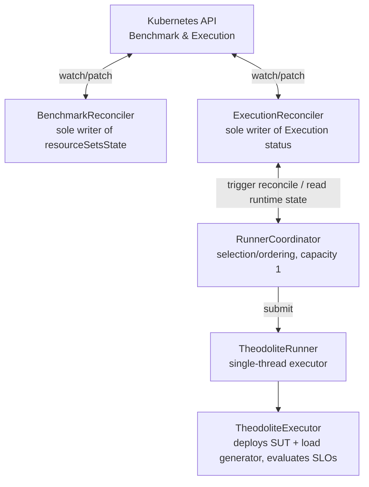
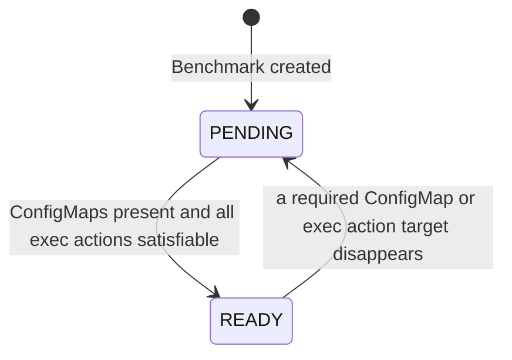
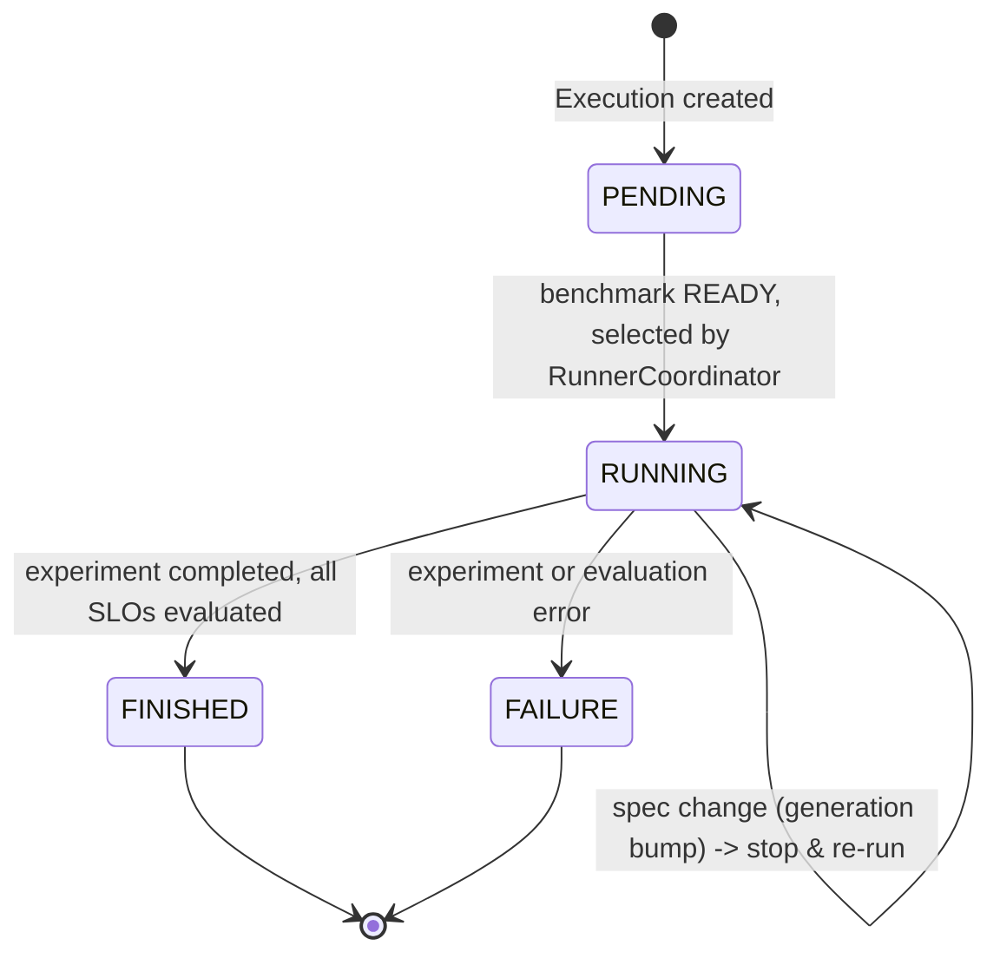

# Operator Architecture

This page describes the internal architecture of the Theodolite operator (`theodolite/`), which
manages the lifecycle of `Benchmark` and `Execution` custom resources and drives benchmark
execution on Kubernetes. It is intended for contributors working on the operator itself.

## Overview

The operator is built on the [Java Operator SDK](https://javaoperatorsdk.io/) (JOSDK). Two
reconcilers watch the CRDs:

- `BenchmarkReconciler` computes and persists whether a `Benchmark`'s resources (referenced
  ConfigMaps, exec-command action targets) are available.
- `ExecutionReconciler` drives the lifecycle of an `Execution` (`PENDING` → `RUNNING` →
  `FINISHED`/`FAILURE`) and is the sole writer of its status.

JOSDK reconciles are per-resource, concurrent, and event-driven — there is no built-in global
scheduler. Since Theodolite must run **at most one experiment at a time**, in strict order
(interrupted-mid-run first, then oldest `creationTimestamp`), that ordering is centralized in a
CDI singleton, `RunnerCoordinator`, rather than derived from reconcile order. The coordinator owns
a `TheodoliteRunner`, a single-thread executor that hosts the actual (potentially long-running)
benchmark execution, keeping `reconcile()` itself fast and non-blocking.

JOSDK leader election ensures that only one operator replica reconciles at a time. When a replica
acquires the `theodolite-operator` Lease, its leader callback clears orphaned cluster state and
opens `OperatorReadiness`; only then does JOSDK start event processing. On leadership loss, the
configured callback closes the readiness gate, so the replica cannot reconcile until it acquires
the Lease again and repeats cleanup.

## Components

### `BenchmarkReconciler`

Computes readiness for a `Benchmark`: all ConfigMaps referenced by its SUT and load-generator
resource sets must be present (tracked via a ConfigMap `InformerEventSource`), and every
exec-command action must be satisfiable (checked live against pods/infrastructure). The result
(`BenchmarkState.PENDING` or `READY`) is written back to `status.resourceSetsState`.

### `ExecutionReconciler`

The single writer of `Execution` status. It does not run benchmarks itself; instead it:

- Gives a freshly created execution its initial `PENDING` state.
- Persists `RUNNING` (with `startTime`) once `RunnerCoordinator` starts a run for it.
- Persists the terminal `FINISHED`/`FAILURE` (with `completionTime`) that the coordinator recorded
  for a finished run.
- Detects a spec change to a currently running execution via `metadata.generation` and asks the
  coordinator to stop it so it re-runs with the new spec.
- Asks the coordinator to (re)select whenever an eligible execution is observed.

It implements JOSDK's `Cleaner` interface to register a finalizer: deleting a running execution
stops the runner cleanly before the resource is removed from the cluster.

An `InformerEventSource` for `Benchmark` links each execution to its benchmark (via
`spec.benchmark`), so a benchmark becoming `READY` triggers reconciliation of its dependent,
still-`PENDING` executions. A custom `ExecutionEventSource` lets `RunnerCoordinator` trigger a
reconcile directly whenever its in-memory runtime state changes (a run started or finished),
without waiting for a Kubernetes-side change to the resource.

### `RunnerCoordinator`

An `@ApplicationScoped` CDI singleton that is the single source of truth for **in-memory runtime
state**: which execution (if any) is currently running, and any terminal result awaiting
persistence by `ExecutionReconciler`. It also implements selection: an execution is eligible when
its benchmark is `READY` and its own state is `PENDING` or `RUNNING` (the latter meaning it was
left running after an operator restart and should resume). Interrupted-mid-run executions are
preferred over new ones; ties are broken by oldest `creationTimestamp`.

`triggerSelection()` is synchronized and only starts a new run when none is active, which — combined
with the single-thread `TheodoliteRunner` — guarantees capacity 1 (at most one experiment runs at a
time, cluster-wide, per operator instance) and correct global ordering.

### `TheodoliteRunner`

Wraps a single-thread `ExecutorService` that hosts the (potentially many-minutes-long) call to
`TheodoliteExecutor.setupAndRunExecution()`. `start()` is non-blocking and reports completion via a
callback; `stop()` signals the currently running execution to stop (used both for a clean shutdown
on deletion and to interrupt a run whose spec changed).

### `TheodoliteExecutor`

The domain-level counterpart to `TheodoliteRunner`: given a `BenchmarkExecution` and a
`KubernetesBenchmark`, it builds the `SearchStrategy` and resolved SLIs/SLOs, sets up and tears
down infrastructure resources, and drives an `ExecutionRunner` across the configured load ×
resource combinations via `ExperimentRunnerImpl`. It has no threading or cancellation logic of its
own — `stop()` is a cooperative flag checked between experiment repetitions — which keeps it
independently testable from the concurrency concerns owned by `TheodoliteRunner`.

## Single-writer status

Each CRD's status is written by exactly one reconciler (`BenchmarkReconciler` for `Benchmark`,
`ExecutionReconciler` for `Execution`). Components that need to influence status — such as
`RunnerCoordinator` recording that a run finished — never patch the resource themselves. Instead
they hold the result in memory and trigger a reconcile, which reads that state and performs the
single, authoritative status write. This avoids concurrent writers racing on the same status
subresource.

## Lifecycles

### Benchmark lifecycle

`Benchmark` has no terminal state: `BenchmarkReconciler` continually recomputes readiness on
every reconcile and toggles between `PENDING` and `READY` as the referenced ConfigMaps and
exec-command targets come and go. Only a `READY` benchmark makes its dependent, `PENDING`
executions eligible for selection by `RunnerCoordinator`.

### Execution lifecycle

`FINISHED` and `FAILURE` are terminal. A `RUNNING` execution observed while the runner is idle
(e.g. after an operator crash) is treated as interrupted mid-run and re-selected with priority,
restarting the experiment from scratch.
