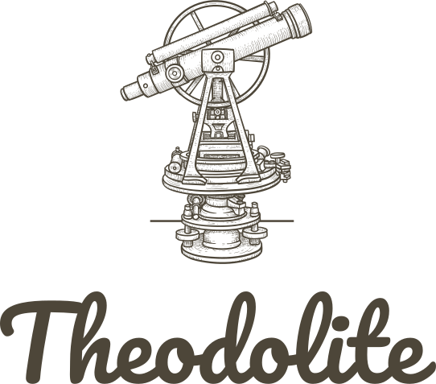

{: .d-block .mx-auto .mb-8 .theodolite-logo }

Theodolite is a framework for benchmarking the horizontal and vertical scalability of cloud-native applications.
{: .fs-6 .fw-300 .text-center }

[Get started now](quickstart){: .btn .btn-primary .fs-5 .mb-4 .mb-md-0 .mr-4 }
[Learn the underlying concepts](benchmarks-and-executions){: .btn .fs-5 .mb-4 .mb-md-0 }
{: .text-center }

---
